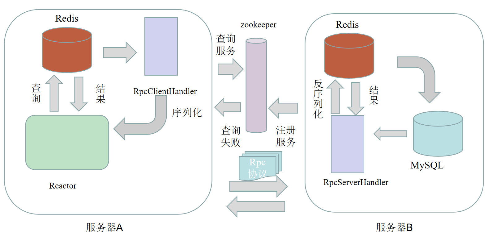
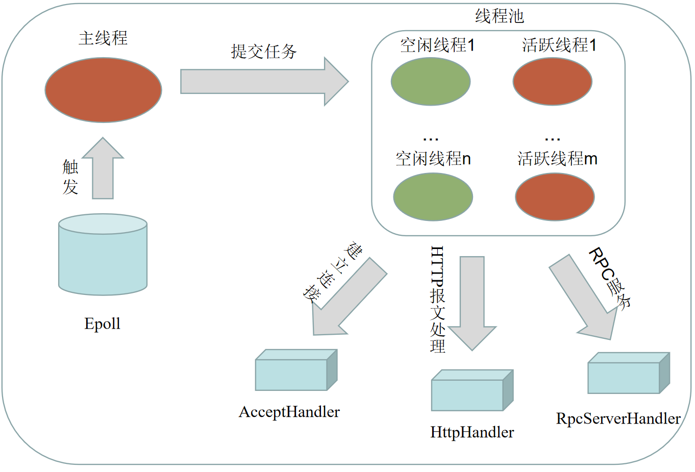
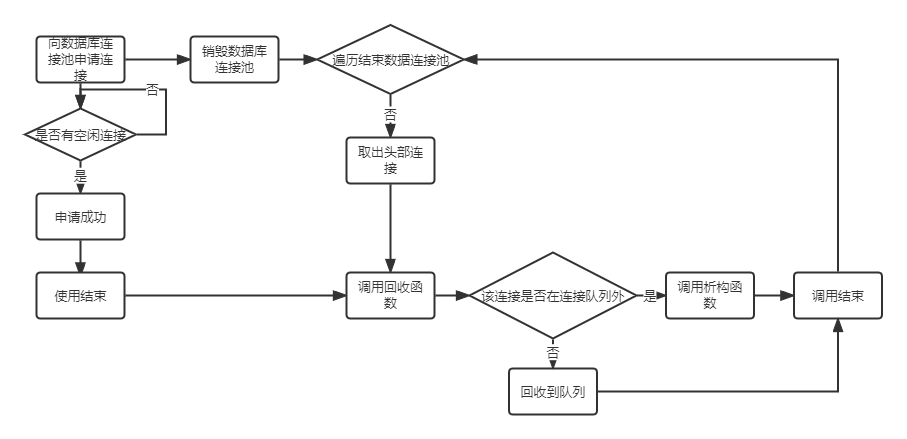

# RPCServer
一个基于RPC的HTTP服务器。

## 开发计划
  - [x] 单例模式下的Reactor半反应堆的实现。
  - [x] 使用模板工厂的模式生产相应的Handler: HTTPHandler、RPCHandler、AcceptHandler。
  - [x] 基于std::shared_ptr的数据库连接池的实现。
  - [x] 支持多线程的模式，线程池支持提交函数。
  - [x] 支持RPC(Remote Procedure Call)，zookeeper提供服务的注册和请求。协议使用[Google Protobuf](https://github.com/protocolbuffers/protobuf)来实现。
  - [x] 使用Redis作为缓存，来实现登陆功能的优化。通过主从复制模式保证两端的Redis数据的同步。
  - [x] 使用Protobuf来实现C++类的反射，将类注入到Redis中。
  - [x] 将最终的项目部署到docker上。
  - [ ] 使用Rabbitmq等消息队列来实现日志功能。
  - [ ] Webench, QPS测试。
  - [ ] 编写如何配置。
  - [ ] 规整代码。
  - [ ] 上传docker。

## 整体框架

整体框架分为两个服务器，服务器A和服务器B，其中服务器A用来处理浏览器发送过来的HTTP报文，Reactor监听事件，并把事件发送到线程池中，线程池中的工作线程则根据对应的事件处理器处理连接请求or解析HTTP报文。当**用户登陆**的时候，服务器A会先查Redis缓存是否有相应的用户信息。如果有我们则向浏览器返回登陆成功。否则我们先查询zookeeper中是否提供了**用户登陆**的服务。如果该服务存在，服务器A会用protobuf将用户登陆信息封装成**RPC协议**的格式发送给服务端B。服务端B接受到请求，则会反序列化拿到用户登陆信息，再去查询Redis，如果Redis没有登陆信息，则会去查询MySQL。若MySQL存在该信息，我们将更新服务器B中的Redis，值得注意的是服务器B的Redis是主Redis，根据主从复制的原则，我们会同步该信息到服务器A中的Redis。

### 基于线程池的Reactor半反应堆

值得注意的是上文的服务器A和服务器B均用到了这种框架。基于线程池的Reactor反应堆框架首先用主线程监听Epoll是否有事件到来，如果有事件到了则提交**任务**到线程池上，然后由线程池的空闲的工作线程取出任务队列中头部的任务，分发给对应的事件处理器执行。

### 数据库连接池的回收策略


### 基于Protobuf的C++反射实现
为了能够将C++的类成功注入到Redis的HMSET中，我们使用了Proto实现了一个C++的反射机制。
下面是一个demo
```C++

const google::protobuf::Descriptor* descriptor = google::protobuf::DescriptorPool::generated_pool()->FindMessageTypeByName("DAO.User");
if(descriptor == NULL){
    //std::cout<<"yes"<<std::endl;
    return false;
}
//利用Descriptor拿到类型注册的instance. 这个是不可修改的.
const google::protobuf::Message * prototype = google::protobuf::MessageFactory::generated_factory()->GetPrototype(descriptor);
// 构造一个可用的消息.
google::protobuf::Message * instance = prototype->New(); //创建新的 person message对象。
auto ref = instance->GetReflection();
for(int i=0;i+1<r->elements;i+=2){
    //auto reflecter = i;//2.1通过字符串"Person"取得的实例instance
    const google::protobuf::FieldDescriptor* field = descriptor->FindFieldByName(r->element[i]->str); // Person这个Message 中有name字段
    if (!field->is_repeated()) {
        //获取数据
        switch (field->cpp_type()){
        case google::protobuf::FieldDescriptor::CppType::CPPTYPE_INT32:{
            int value1 = ref->GetInt32(*instance, field);
            parseData(value1, r->element[i+1]->str);
            ref->SetInt32(instance, field, value1) ; //反射来设置name字段
            break;
          }
        case google::protobuf::FieldDescriptor::CppType::CPPTYPE_STRING:{
            std::string value2 = ref->GetString(*instance, field);
            std::string str = r->element[i+1]->str;
            str = str.substr(1,str.size()-2);
            parseData(value2, str);
            ref->SetString(instance, field, value2) ; //反射来设置name字段
            break;
          }
        case google::protobuf::FieldDescriptor::CppType::CPPTYPE_DOUBLE:{
            double value3 = ref->GetDouble(*instance, field);
            parseData(value3, r->element[i+1]->str);
            ref->SetDouble(instance, field, value3) ; //反射来设置name字段
            break;
          }
        }
    }
    else {
        std::cout<<"error"<<std::endl;
    }
}
```

## 配置说明
* 服务器测试环境
	* Ubuntu版本18.04，20.04均可。
	* MySQL版本5.7.37。
	* Docker版本18.09.0。
	* zookeeper版本3.4.11。
	* CMake版本3.22.1。
	* Protobuf版本3.9.2。
	* Redis版本6.0.9。

值得说明的是Redis和zookeeper都需要装对应的C++客户端的工具。

## 参考资料
* [zookeeper3.4.11搭建安装](https://www.dandelioncloud.cn/article/details/1514841215936839682)
* [Zookeeper C客户端库编译](https://blog.csdn.net/weixin_41981080/article/details/112041464)
* [C++配置使用zookeeper（ubuntu18.04）](https://blog.csdn.net/PPprogrammer/article/details/116610289)
* [c++操作redis——(1)安装和环境配置](https://blog.csdn.net/qq_40744423/article/details/112460737)

